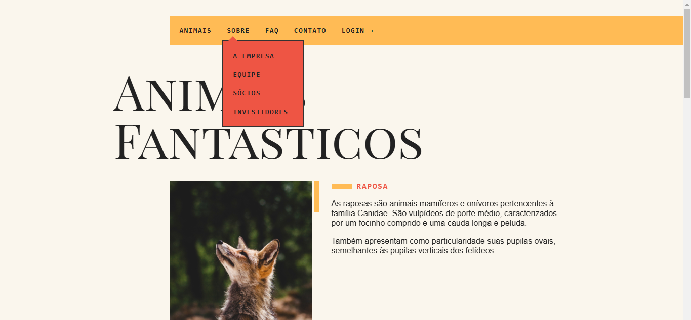
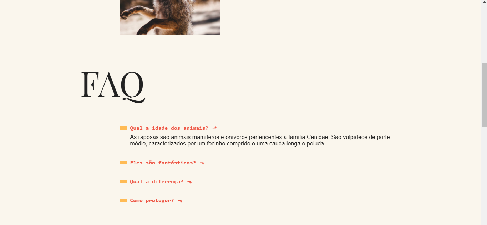
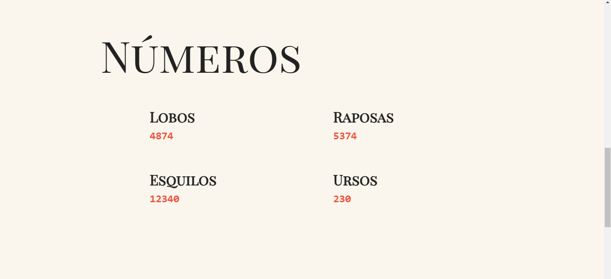
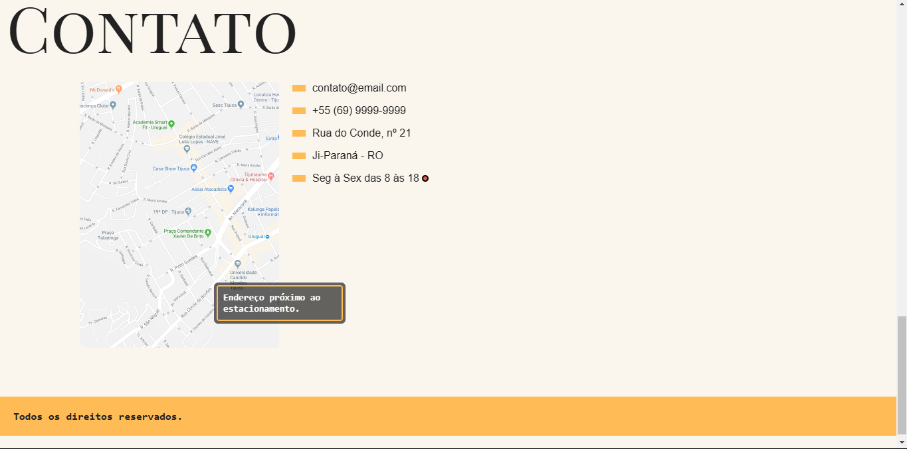
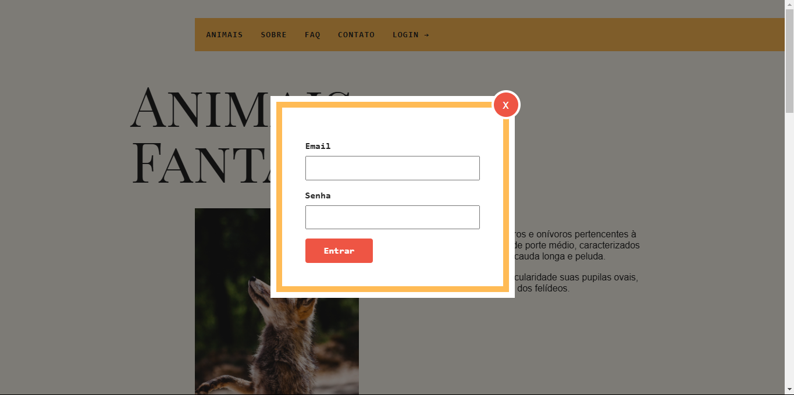
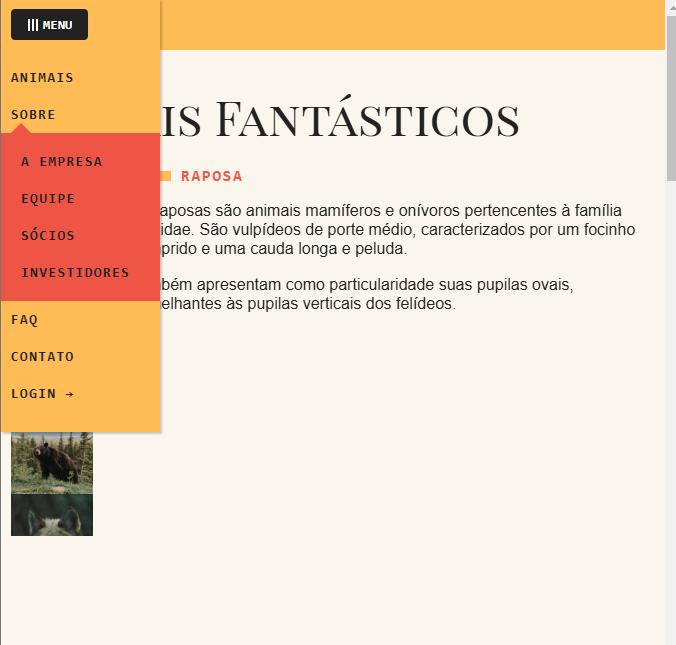

# 🐱 Animais Fantasticos

Este é um projeto desenvolvido durante o curso "JavaScript Completo ES6" na plataforma **Origamid**. Os créditos vão para a plataforma e para o professor **André Rafael**.

<p><br>
<p><br>
<p><br>
<p><br>
Demonstrações do projeto
<p><br>
Demonstração do modal
<p><br>
Demonstração do menu mobile

## 📚 Tabela de Conteúdos

- [Descrição](#descrição)
- [Funcionalidades](#funcionalidades)
- [Tecnologias Utilizadas](#tecnologias-utilizadas)
- [Como executar o projeto](#como-executar-o-projeto)
- [Ferramentas Utilizadas](#ferramentas-utilizadas)
- [Agradecimentos](#agradecimentos)

## 📄 Descrição

O projeto "Animais Fantasticos" utiliza JavaScript para criar animações interativas que apresentam informações sobre diversos animais. A tela foi desenvolvida visando aplicar os conceitos de JavaScript anteriormente estudados no curso.

## 📱 Funcionalidades

Além de exbir informações sobre alguns animais, a tela apresenta funcionalidades de:
- _Navegação por tabs_;
- _Accordion list_;
- _Scroll suave_;
- _Animação ao scroll_;
- _Modal de login_;
- _Tooltip no mapa_;
- _Dropdown no menu (na seção Sobre)_;
- _Menu mobile_;
- _Animação de números_;
- _Horário de funcionamento interativo (com feedback de cor, de acordo com o horário atual)_;

## 👩🏻‍💻 Tecnologias Utilizadas

- **HTML**: Estrutura básica do projeto;
- **CSS**: Estilização e layout;
- **JavaScript**: Lógica e animações.

## 🖥️ Como Executar o Projeto

1. Clone o repositório:
   ```bash
   git clone https://github.com/soouzaana/AnimaisFantasticos.git
   ```
2. Navegue até o diretório do projeto:
   ```bash
   cd AnimaisFantasticos
   ```
3. Abra o arquivo `index.html` em um navegador da sua escolha.

## 💻 Ferramentas Utilizadas

- [Visual Studio Code](https://code.visualstudio.com/);
- [Plataforma Origamid](https://www.origamid.com/).

## 👍 Agradecimentos

Agradeço à plataforma Origamid e ao professor André Rafael pela excelente formação e suporte durante o curso.
